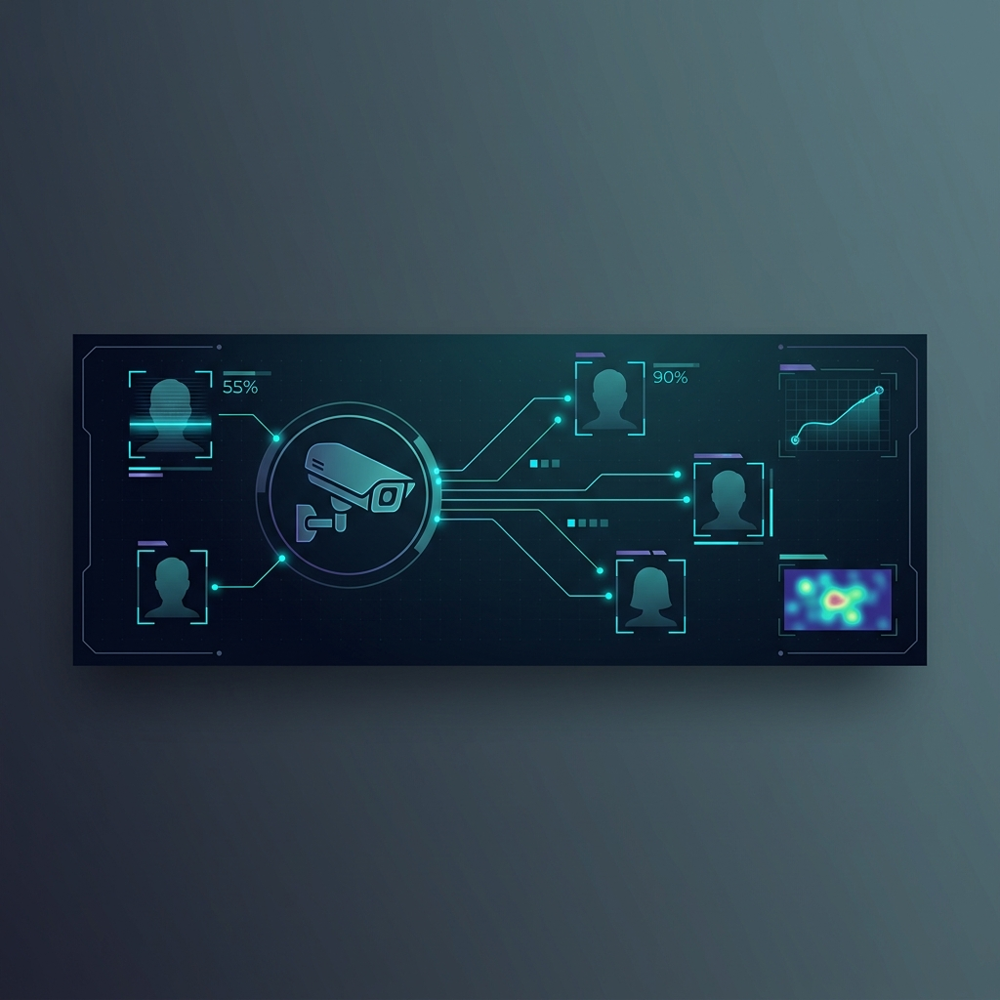
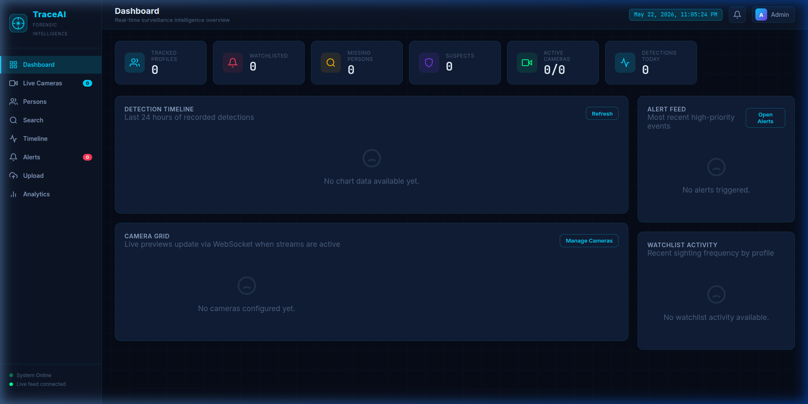
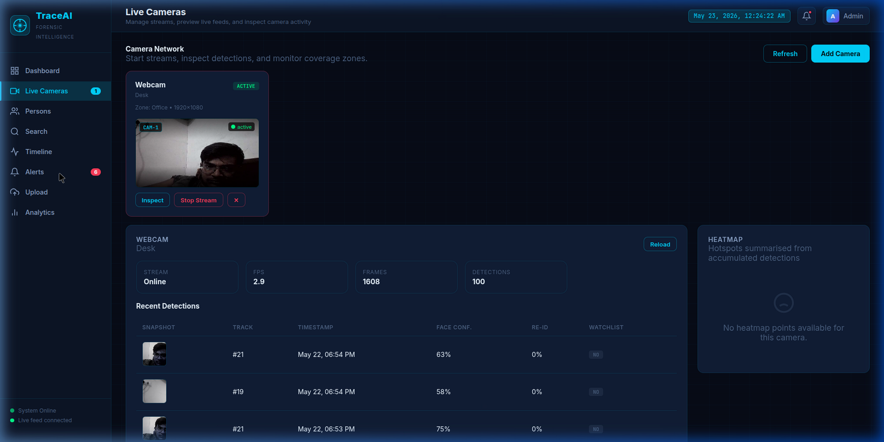
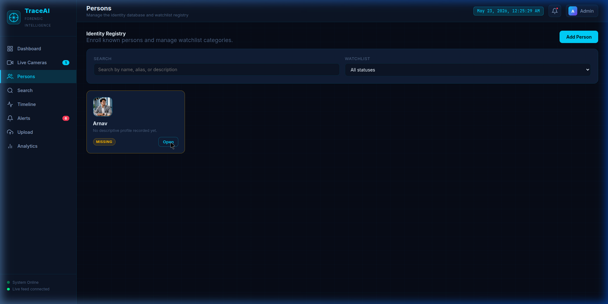
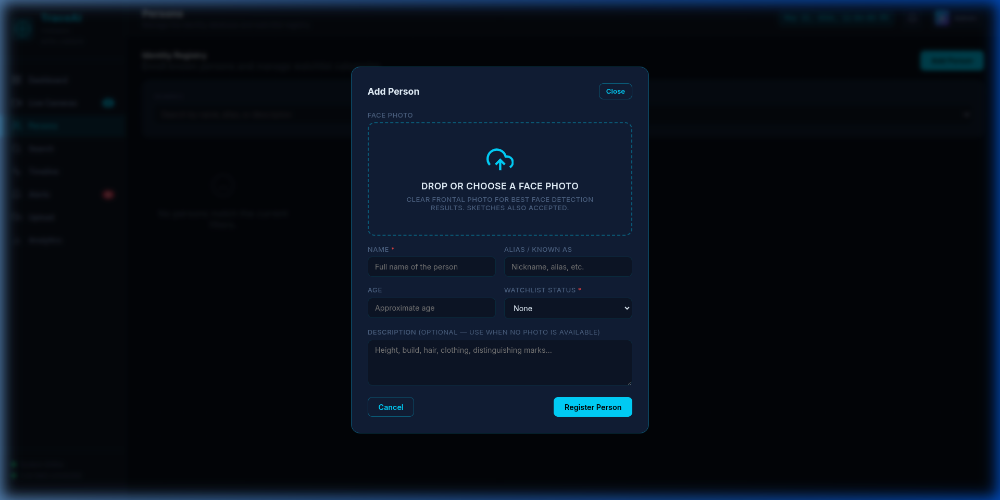

<div align="center">



# TraceAI — Forensic Surveillance Intelligence Platform

**Real-time person detection, face recognition, identity re-identification, and movement reconstruction — powered by YOLOv8, ArcFace, and ByteTrack.**

[](https://python.org)
[](https://fastapi.tiangolo.com)
[](https://docs.ultralytics.com)
[](https://github.com/deepinsight/insightface)
[](LICENSE)

[Dashboard](#-dashboard-overview) · [Quick Start](#-quick-start) · [Architecture](#-architecture) · [API Reference](#-api-reference) · [Usage Guide](#-usage-guide)

</div>

---

## 📋 Table of Contents

- [Overview](#-overview)
- [Key Features](#-key-features)
- [Dashboard Overview](#-dashboard-overview)
- [Architecture](#-architecture)
- [Tech Stack](#-tech-stack)
- [Project Structure](#-project-structure)
- [Quick Start](#-quick-start)
- [Configuration](#-configuration)
- [Usage Guide](#-usage-guide)
- [API Reference](#-api-reference)
- [AI Pipeline](#-ai-pipeline-deep-dive)
- [Database Schema](#-database-schema)
- [WebSocket Protocol](#-websocket-protocol)
- [Troubleshooting](#-troubleshooting)
- [Roadmap](#-roadmap)
- [Contributing](#-contributing)
- [License](#-license)

---

## 🔍 Overview

**TraceAI** is a production-grade, AI-powered forensic surveillance intelligence platform designed for security teams, law enforcement, and facility managers. It transforms standard CCTV camera feeds into an actionable intelligence dashboard by combining three core computer vision capabilities:

| Capability | Model | Description |
|---|---|---|
| **Person Detection** | YOLOv8n | Real-time detection of persons in video streams with bounding-box localization |
| **Face Recognition** | ArcFace (w600k_r50) via InsightFace | 512-dimensional face embedding extraction and cosine-similarity matching |
| **Multi-Object Tracking** | ByteTrack | Persistent identity tracking across frames with track-ID assignment |

The system ingests live camera feeds (webcams, RTSP streams, or video files), detects persons, extracts face embeddings, matches them against an enrolled identity database, and generates real-time alerts for watchlist hits — all within a single, self-contained application.

---

## ✨ Key Features

### 🎯 Core Intelligence
- **Real-Time Person Detection** — YOLOv8n processes live video at 8-15 FPS with adaptive frame skipping
- **Face Recognition & Re-ID** — ArcFace-based 512-d embeddings with cosine similarity matching (threshold: 0.60)
- **Watchlist Alerting** — Instant HIGH-severity alerts when missing persons or suspects are detected
- **Movement Timeline** — Automatic dwell-time tracking with enter/exit timestamps per camera zone
- **Multi-Camera Support** — Up to 16 concurrent streams with independent processing pipelines

### 📊 Analytics & Visualization
- **Live Dashboard** — Real-time stat cards, detection timeline charts, camera grid with WebSocket-powered previews
- **Detection Snapshots** — Automatic cropping and storage of every detected person with thumbnail previews
- **Heatmap Data** — Spatial density mapping of person detections per camera zone
- **Activity Summaries** — Per-camera detection counts, hourly breakdowns, and watchlist activity feeds

### 🖥️ Operations
- **Identity Registry** — Register persons with face photos, aliases, age, description, and watchlist categories
- **Face Search** — Upload a photo to find matching persons across the entire enrolled database
- **Video Upload Processing** — Batch-process recorded video files through the full detection pipeline
- **Camera Management** — Add/remove cameras, start/stop streams, inspect per-camera statistics

### 🔌 Real-Time Communication
- **WebSocket Live Feed** — Frame previews, detection events, and alerts pushed to connected clients in real-time
- **Instant Alert Notifications** — Browser notification badges and alert feed updates on watchlist matches

---

## 📸 Dashboard Overview

<div align="center">

### Command Center Dashboard


*Real-time stat cards, detection timeline, camera grid, alert feed, and watchlist activity — all updating live via WebSocket.*

---

### Live Camera Monitoring


*Active webcam stream with YOLO person detection, snapshot thumbnails, Re-ID confidence scores, and watchlist hit indicators.*

---

### Identity Registry


*Enrolled person profile with face photo, watchlist status badge, and quick-access controls.*

---

### Person Registration


*Face-photo-first registration flow with drag-and-drop upload, watchlist categorization, and optional description.*

</div>

---

## 🏗️ Architecture

```
┌─────────────────────────────────────────────────────────────────┐
│                        CLIENT (Browser)                         │
│  ┌──────────┐  ┌──────────┐  ┌──────────┐  ┌───────────────┐   │
│  │ app.js   │  │ api.js   │  │styles.css│  │  index.html   │   │
│  │ (68 KB)  │  │ REST API │  │ Dark UI  │  │  SPA Shell    │   │
│  └────┬─────┘  └────┬─────┘  └──────────┘  └───────────────┘   │
│       │              │                                           │
│       │  WebSocket   │  HTTP/REST                                │
└───────┼──────────────┼───────────────────────────────────────────┘
        │              │
┌───────▼──────────────▼───────────────────────────────────────────┐
│                    FastAPI Backend (:8000)                        │
│                                                                  │
│  ┌─── API Layer ──────────────────────────────────────────────┐  │
│  │  /api/v1/persons     → CRUD, face enroll, image search    │  │
│  │  /api/v1/cameras     → CRUD, stream start/stop, stats     │  │
│  │  /api/v1/analytics   → dashboard, timeline, alerts        │  │
│  │  /api/v1/upload      → video file processing              │  │
│  │  /ws                 → WebSocket live feed                 │  │
│  └────────────────────────────────────────────────────────────┘  │
│                                                                  │
│  ┌─── AI Services ────────────────────────────────────────────┐  │
│  │  DetectionService    → YOLOv8n person detection            │  │
│  │  EmbeddingService    → InsightFace ArcFace embeddings      │  │
│  │  TrackerService      → ByteTrack multi-object tracking     │  │
│  │  StreamProcessor     → Camera pipeline orchestrator        │  │
│  └────────────────────────────────────────────────────────────┘  │
│                                                                  │
│  ┌─── Data Layer ─────────────────────────────────────────────┐  │
│  │  SQLite (async)      → persons, cameras, detections, ...   │  │
│  │  /data/embeddings/   → .npy face embedding files           │  │
│  │  /data/snapshots/    → detection crop JPEGs                │  │
│  │  /data/uploads/      → face photos & video files           │  │
│  └────────────────────────────────────────────────────────────┘  │
└──────────────────────────────────────────────────────────────────┘
```

### Request Flow: Live Stream Detection

```
Camera Feed (webcam/RTSP/file)
    │
    ▼
StreamProcessor._process_loop()
    │
    ├── cv2.VideoCapture → read frame (BGR)
    │       │
    │       ▼
    ├── DetectionService.detect_persons(frame_rgb)
    │       │  YOLOv8n → filter class=person → DetectionBox[]
    │       ▼
    ├── TrackerService.update(detections)
    │       │  ByteTrack → assign persistent track IDs
    │       ▼
    ├── For each track:
    │   ├── Crop person region from BGR frame
    │   ├── EmbeddingService.get_embedding(crop)
    │   │       │  InsightFace → detect face in crop → 512-d ArcFace vector
    │   │       ▼
    │   ├── find_best_match(embedding, enrolled_cache)
    │   │       │  Cosine similarity ≥ 0.60 → person_id match
    │   │       ▼
    │   ├── Save snapshot JPEG to /data/snapshots/
    │   ├── INSERT Detection record to SQLite
    │   ├── Update timeline tracker (dwell time)
    │   └── If watchlist hit → fire Alert + WebSocket push
    │
    └── Send frame preview via WebSocket (JPEG thumbnail + annotations)
```

---

## 🛠️ Tech Stack

### Backend
| Technology | Version | Purpose |
|---|---|---|
| **Python** | 3.10+ | Runtime |
| **FastAPI** | 0.111.0 | Async REST API framework |
| **Uvicorn** | 0.30.1 | ASGI server |
| **SQLAlchemy** | 2.0.30 | Async ORM (SQLite + aiosqlite) |
| **YOLOv8** | Ultralytics 8.2.27 | Person detection |
| **InsightFace** | 0.7.3 | Face detection + ArcFace recognition |
| **ONNX Runtime** | 1.18.0 | Optimized model inference |
| **OpenCV** | 4.9.0 | Image/video processing |
| **NumPy** | 1.26.4 | Numerical operations |
| **Loguru** | 0.7.2 | Structured logging |

### Frontend
| Technology | Purpose |
|---|---|
| **Vanilla JavaScript** | Single-file SPA (app.js — 72 KB) |
| **Vanilla CSS** | Dark-themed design system (styles.css — 19 KB) |
| **WebSocket API** | Real-time frame previews and alert notifications |
| **Canvas API** | Detection bounding box rendering |

### AI Models (auto-downloaded on first run)
| Model | File | Size | Purpose |
|---|---|---|---|
| YOLOv8n | `yolov8n.pt` | 6.5 MB | Person detection (COCO class 0) |
| buffalo_l | `~/.insightface/models/buffalo_l/` | ~340 MB | Face analysis pack |
| ├─ det_10g | `det_10g.onnx` | | Face detection (RetinaFace) |
| ├─ w600k_r50 | `w600k_r50.onnx` | | Face recognition (ArcFace, 512-d) |
| ├─ 1k3d68 | `1k3d68.onnx` | | 3D landmark detection (68 pts) |
| ├─ 2d106det | `2d106det.onnx` | | 2D landmark detection (106 pts) |
| └─ genderage | `genderage.onnx` | | Gender & age estimation |

---

## 📂 Project Structure

```
TraceAI/
├── backend/
│   ├── app/
│   │   ├── api/                    # REST API endpoints
│   │   │   ├── persons.py          #   CRUD, face enroll, image search
│   │   │   ├── cameras.py          #   CRUD, stream control, stats
│   │   │   ├── analytics.py        #   Dashboard, timeline, alerts
│   │   │   ├── video_upload.py     #   Video file processing
│   │   │   └── websocket.py        #   WebSocket connection handler
│   │   ├── core/
│   │   │   └── websocket_manager.py    # WS broadcast manager
│   │   ├── models/
│   │   │   ├── database.py         #   SQLAlchemy ORM models
│   │   │   └── schemas.py          #   Pydantic request/response schemas
│   │   ├── services/
│   │   │   ├── detection_service.py    # YOLOv8 person detector
│   │   │   ├── embedding_service.py    # InsightFace ArcFace embeddings
│   │   │   ├── tracker_service.py      # ByteTrack multi-object tracker
│   │   │   └── stream_processor.py     # Camera pipeline orchestrator
│   │   ├── config.py               #   Centralized settings (pydantic)
│   │   └── main.py                 #   FastAPI app, lifespan, routes
│   ├── data/                       # Runtime data (gitignored)
│   │   ├── db/traceai.db           #   SQLite database
│   │   ├── embeddings/             #   .npy face embedding files
│   │   ├── snapshots/              #   Detection crop JPEGs
│   │   ├── uploads/                #   Face photos & video files
│   │   └── logs/                   #   Application logs
│   ├── requirements.txt
│   ├── run.py                      # Entry point with banner
│   └── yolov8n.pt                  # YOLOv8 nano weights
├── frontend/
│   ├── index.html                  # SPA shell with meta tags
│   ├── src/
│   │   ├── app.js                  # Complete SPA logic (72 KB)
│   │   ├── api.js                  # REST/WebSocket API client
│   │   └── styles.css              # Dark theme design system
│   ├── assets/                     # Static assets (icons, etc.)
│   └── public/                     # Public files
├── docs/
│   └── images/                     # README screenshots
├── setup.sh                        # Automated environment setup
└── README.md
```

---

## 🚀 Quick Start

### Prerequisites

- **Python 3.10+** with `venv` support
- **Webcam** (optional — for live testing)
- **~2 GB disk space** (for AI model weights on first run)
- **Linux / macOS** (Windows with WSL2 also works)

### 1. Clone & Setup

```bash
git clone https://github.com/ArnavPundir22/TraceAI-Intelligent-Missing-Person-Suspect-Tracking-System.git
cd TraceAI-Intelligent-Missing-Person-Suspect-Tracking-System

# Automated setup (creates venv, installs all dependencies)
chmod +x setup.sh
./setup.sh
```

<details>
<summary><strong>Manual setup (if setup.sh fails)</strong></summary>

```bash
python3 -m venv .venv
source .venv/bin/activate
pip install --upgrade pip "setuptools<81" wheel
pip install numpy==1.26.4 cython
pip install --no-build-isolation -r backend/requirements.txt
```

</details>

### 2. Start the Server

```bash
source .venv/bin/activate
python backend/run.py
```

You should see:

```
================================================================
 TraceAI — Forensic Surveillance Intelligence
================================================================
 Dashboard  →  http://localhost:8000
 API Docs   →  http://localhost:8000/api/docs
 WebSocket  →  ws://localhost:8000/ws
================================================================

✓ Database initialized
✓ AI models ready (InsightFace engine)
🚀 TraceAI is live → http://localhost:8000
```

### 3. Open the Dashboard

Navigate to **http://localhost:8000** in your browser. The dashboard loads instantly with a live WebSocket connection.

---

## ⚙️ Configuration

All settings are managed via environment variables or a `.env` file in the project root. The defaults work out of the box.

| Variable | Default | Description |
|---|---|---|
| `DEBUG` | `True` | Enable debug logging |
| `SECRET_KEY` | `traceai-super-...` | JWT signing key (change in production) |
| `YOLO_MODEL` | `yolov8n.pt` | YOLO model file (n/s/m/l/x variants) |
| `FACE_RECOGNITION_MODEL` | `ArcFace` | Recognition model name |
| `EMBEDDING_DIM` | `512` | Face embedding dimensionality |
| `FACE_SIMILARITY_THRESHOLD` | `0.60` | Cosine similarity threshold for identity match |
| `CONFIDENCE_THRESHOLD` | `0.50` | YOLO detection confidence minimum |
| `FRAME_SKIP` | `3` | Process every Nth frame (higher = faster, less accurate) |
| `MAX_STREAMS` | `16` | Maximum concurrent camera streams |

Example `.env`:
```env
FACE_SIMILARITY_THRESHOLD=0.55
FRAME_SKIP=2
DEBUG=False
SECRET_KEY=your-production-secret-key-here
```

---

## 📖 Usage Guide

### Step 1 — Register a Person with Face Photo

1. Go to **Persons** → **Add Person**
2. Upload a clear, frontal face photo (JPG/PNG)
3. Fill in name, watchlist status (None / Missing / Suspect / Person of Interest)
4. Click **Register Person**

The system immediately generates a 512-d ArcFace embedding and stores it for matching.

**Via API:**
```bash
curl -X POST http://localhost:8000/api/v1/persons/ \
  -F "name=John Doe" \
  -F "watchlist_status=missing" \
  -F "face_photo=@/path/to/face.jpg"
```

### Step 2 — Add a Camera

1. Go to **Live Cameras** → **Add Camera**
2. Enter a name, location, and stream URL:
   - `0` — Default webcam
   - `1`, `2` — Additional USB cameras
   - `rtsp://...` — IP camera RTSP stream
   - `/path/to/video.mp4` — Video file (loops)
3. Click **Create Camera**

### Step 3 — Start Streaming

1. Click **Start Stream** on the camera card
2. The AI pipeline begins:
   - YOLO detects persons in each frame
   - ByteTrack assigns persistent track IDs
   - InsightFace extracts face embeddings from person crops
   - Embeddings are matched against enrolled persons
3. Detections appear in the **Recent Detections** table with snapshot thumbnails
4. **Watchlist matches** trigger instant HIGH-severity alerts

### Step 4 — Monitor & Investigate

- **Dashboard** — Real-time stats, detection timeline, camera grid, alert feed
- **Alerts** — Review and acknowledge watchlist match alerts
- **Timeline** — View per-person movement history with enter/exit timestamps
- **Search** — Upload a photo to find matching persons in the database
- **Analytics** — Camera activity summaries, detection distributions

---

## 📡 API Reference

The full interactive API documentation is available at **http://localhost:8000/api/docs** (Swagger UI).

### Persons

| Method | Endpoint | Description |
|---|---|---|
| `POST` | `/api/v1/persons/` | Register a new person (multipart form with optional face photo) |
| `GET` | `/api/v1/persons/` | List all persons with optional search & watchlist filter |
| `GET` | `/api/v1/persons/{id}` | Get person details |
| `PUT` | `/api/v1/persons/{id}` | Update person profile |
| `DELETE` | `/api/v1/persons/{id}` | Soft-delete a person |
| `POST` | `/api/v1/persons/{id}/enroll-face` | Upload face photo & generate embedding |
| `GET` | `/api/v1/persons/{id}/face-image` | Serve enrolled face image |
| `GET` | `/api/v1/persons/{id}/timeline` | Get movement timeline events |
| `POST` | `/api/v1/persons/search/by-image` | Upload photo → find matching persons |

### Cameras

| Method | Endpoint | Description |
|---|---|---|
| `POST` | `/api/v1/cameras/` | Create a new camera |
| `GET` | `/api/v1/cameras/` | List all cameras |
| `DELETE` | `/api/v1/cameras/{id}` | Delete a camera |
| `POST` | `/api/v1/cameras/{id}/start` | Start live stream processing |
| `POST` | `/api/v1/cameras/{id}/stop` | Stop stream |
| `GET` | `/api/v1/cameras/{id}/stats` | Get camera statistics |
| `GET` | `/api/v1/cameras/{id}/detections` | Get recent detections |
| `GET` | `/api/v1/cameras/{id}/heatmap` | Get spatial heatmap data |

### Analytics

| Method | Endpoint | Description |
|---|---|---|
| `GET` | `/api/v1/analytics/dashboard` | Aggregated dashboard stats |
| `GET` | `/api/v1/analytics/detections/timeline` | Hourly detection counts |
| `GET` | `/api/v1/analytics/alerts/recent` | Recent alerts with severity filter |
| `POST` | `/api/v1/analytics/alerts/{id}/acknowledge` | Acknowledge an alert |
| `GET` | `/api/v1/analytics/watchlist/activity` | Watchlist match activity feed |
| `GET` | `/api/v1/analytics/cameras/activity-summary` | Per-camera activity summary |

### WebSocket

| Endpoint | Description |
|---|---|
| `ws://localhost:8000/ws` | Real-time detection events, frame previews, alerts |

---

## 🧠 AI Pipeline Deep Dive

### 1. Person Detection (YOLOv8n)

YOLOv8 nano runs on every Nth frame (configurable via `FRAME_SKIP`). Only detections with class `person` (COCO class 0) and confidence ≥ 0.50 are forwarded to the tracker.

```python
# Detection output per frame
DetectionBox(x1, y1, x2, y2, confidence, class="person")
```

### 2. Multi-Object Tracking (ByteTrack)

ByteTrack assigns persistent `track_id` values across frames, handling occlusions and re-appearances. Each track represents a continuous observation of one person.

### 3. Face Embedding (InsightFace / ArcFace)

For each tracked person crop, InsightFace:
1. Runs its own face detector (RetinaFace `det_10g`) on the person crop
2. Aligns the detected face using 5-point landmarks
3. Extracts a 512-dimensional L2-normalized embedding via ArcFace (`w600k_r50`)

```python
# Embedding: float32[512], L2-normalized
embedding = face_app.get(crop)[0].normed_embedding
```

### 4. Identity Matching

The extracted embedding is compared against all enrolled embeddings using **cosine similarity**:

```
similarity = dot(query, enrolled) / (||query|| × ||enrolled||)
```

A match is declared when `similarity ≥ FACE_SIMILARITY_THRESHOLD` (default: 0.60). The best match above threshold is selected.

### 5. Timeline Tracking

The stream processor maintains an in-memory `_active_timelines` dict:
- **Person enters camera view** → start timer
- **Person seen again** → update `last_seen`
- **30 seconds of inactivity** → finalize `TimelineEvent` with duration
- **Stream stop** → flush all open timelines

---

## 🗄️ Database Schema

```
┌──────────────┐    ┌──────────────┐    ┌──────────────────┐
│   persons    │    │   cameras    │    │   detections     │
├──────────────┤    ├──────────────┤    ├──────────────────┤
│ id (PK)      │◄──┐│ id (PK)      │◄──┐│ id (PK)          │
│ name         │   ││ name         │   ││ person_id (FK)───┘
│ alias        │   ││ location     │   ││ camera_id (FK)───┘
│ age          │   ││ stream_url   │   ││ track_id         │
│ description  │   ││ zone         │   ││ timestamp        │
│ watchlist    │   ││ status       │   ││ bbox (x1,y1,x2,y2)│
│ embedding    │   ││ fps          │   ││ face_confidence   │
│ face_image   │   ││ resolution   │   ││ reid_confidence   │
│ is_active    │   │└──────────────┘   ││ snapshot_path     │
└──────────────┘   │                   ││ is_watchlist_hit  │
                   │                   │└──────────────────┘
┌──────────────────┤                   │
│ timeline_events  │                   │  ┌──────────────┐
├──────────────────┤                   │  │   alerts      │
│ id (PK)          │                   │  ├──────────────┤
│ person_id (FK)───┘                   │  │ id (PK)      │
│ camera_id (FK)───────────────────────┘  │ person_id    │
│ entered_at       │                      │ camera_id    │
│ exited_at        │                      │ severity     │
│ duration_seconds │                      │ title        │
│ confidence       │                      │ message      │
│ snapshot_path    │                      │ snapshot     │
└──────────────────┘                      │ acknowledged │
                                          └──────────────┘
```

---

## 🔌 WebSocket Protocol

Connect to `ws://localhost:8000/ws` to receive real-time events:

### Frame Preview Event
```json
{
  "type": "frame",
  "camera_id": 1,
  "frame": "<base64 JPEG>",
  "detections": [
    {
      "track_id": 5,
      "person_id": 1,
      "bbox": [120, 80, 340, 520],
      "reid_score": 0.62,
      "is_watchlist_hit": true
    }
  ],
  "fps": 8.2,
  "frame_count": 1542
}
```

### Alert Event
```json
{
  "type": "alert",
  "severity": "HIGH",
  "title": "Watchlist Match: Arnav",
  "message": "MISSING — Arnav detected at Camera 1 (Office)",
  "person_id": 1,
  "camera_id": 1
}
```

---

## 🔧 Troubleshooting

| Issue | Cause | Fix |
|---|---|---|
| `DeepFace not available — using mock embeddings` | Keras/TensorFlow misconfiguration | TraceAI now uses InsightFace by default — ensure `insightface` and `onnxruntime` are installed |
| Face enrolled but 0% Re-ID in live stream | Color space mismatch (RGB vs BGR) | Fixed in latest version — InsightFace receives BGR frames directly |
| `No face detected in uploaded image` | Photo is too small, blurry, or profile-angle | Use a clear frontal face photo, minimum 112×112 pixels |
| Webcam not opening | Permission denied or wrong device index | Try `stream_url=0` for default webcam, or check `ls /dev/video*` |
| Low FPS (< 5) | CPU-bound inference without GPU | Increase `FRAME_SKIP` to 5-10, or use a CUDA-enabled GPU |
| Snapshots not loading in UI | Static file mount missing | Ensure server was started from project root: `python backend/run.py` |

---

## 🗺️ Roadmap

- [x] Real-time person detection with YOLOv8
- [x] Face recognition with InsightFace ArcFace
- [x] Multi-object tracking with ByteTrack
- [x] Watchlist alerting system
- [x] Movement timeline reconstruction
- [x] Detection snapshot serving
- [x] WebSocket live frame previews
- [x] Person edit and camera delete operations
- [ ] JWT authentication & role-based access control
- [ ] GPU-accelerated inference (CUDA / TensorRT)
- [ ] Multi-face enrollment per person
- [ ] Spatial geofence alerts (zone intrusion)
- [ ] Export detection reports (PDF / CSV)
- [ ] Docker containerization
- [ ] Horizontal scaling with Redis pub/sub

---

## 🤝 Contributing

Contributions are welcome! Please follow these steps:

1. Fork the repository
2. Create a feature branch: `git checkout -b feature/your-feature`
3. Commit changes: `git commit -m "Add your feature"`
4. Push to branch: `git push origin feature/your-feature`
5. Open a Pull Request

### Development Setup

```bash
# Clone your fork
git clone https://github.com/YOUR_USERNAME/TraceAI-Intelligent-Missing-Person-Suspect-Tracking-System.git
cd TraceAI-Intelligent-Missing-Person-Suspect-Tracking-System

# Setup environment
./setup.sh
source .venv/bin/activate

# Start in debug mode
DEBUG=True python backend/run.py
```

---

## 📄 License

This project is licensed under the **MIT License** — see the [LICENSE](LICENSE) file for details.

---

<div align="center">

**Built with ❤️ by [Arnav Pundir](https://github.com/ArnavPundir22)**

*TraceAI — Because every identity tells a story.*

</div>

